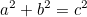
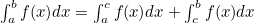
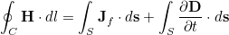

# Markdown LaTeX Parser

This program parses LaTeX math in a `README.md` file and generates a new `README.md` file with the math replaced by markdown image tags to the math. The math images are placed in a folder inside your repository, and when displayed on GitHub, the math will appear in the markdown. This program supports inline math and displayed math. The program supports user LaTeX macros and the use of LaTeX packages. This program uses the powerful texlive LaTeX compiler and a docker image with this program, and texlive is available on Docker Hub.

**Github now natively supports LaTex. If you are writing documentation exclusively for Github, use it instead of this program. It looks way better!**
https://github.blog/2022-05-19-math-support-in-markdown/

Native github LaTex:
$$
a^2+b^2=c^2
$$

Readme-tex output:




# Demo

For example, this  was inline math. Inline math is used when it is mentioned as part of the text. Inline math LaTeX is placed inside two $ signs. If the math is to be displayed on a seperate line, use double '$$' here follows a full equation:




To add math, simply surround it with single or double $ signs:


Result


## Install and usage
If you are just interested in adding LaTeX to your readme file, using the docker image is recommended. It comes with readme-tex and the dependencies needed to compile LaTeX math.

1. [Install docker.](https://docs.docker.com/install/)
2. Pull the image 
`docker pull maltegruber/readme-tex:1.0.0`
3. Create a folder named `doc` where your README.md file is and move the README.md file into this folder.
3. run readme-tex `docker run -ti --rm -v $(pwd):/test/usr maltegruber/readme-tex:1.0.0`


## Advanced Formulas

By default, the parser includes the ansmath package. This allows for complicated math such as


## Template Injection
During the compilation process, the math is added to a template.tex file, which is then compiled using texlive's `latex` command.
```latex
\documentclass{article}
\pagestyle{empty}
\usepackage{amsmath}
HEADER_INJECTION_HERE
\begin{document}
FORMULA_PLACED_HERE
\end{document}
```
The `FORMULA_PLACED_HERE` statement is replaced for every encountered formula in the input document (With the math LaTeX). However, the `HEADER_INJECTION_HERE` is the same for the entire document (In other words, shared by every math statement). By default, it is an empty string, but surrounding commands with $@ at the beginning of the readme file *before any other LaTeX commands* the user can inject LaTeX code into the header, before the `\begin{document}` command.

Example:
```
$@
\usepackage{amsmath}
$@
```

### Macros
It is possible to add macros into the injection command.
```
$@
\renewcommand{\vector}[1]{(x_1,x_2,\ldots,x_{#1})}
$@
```
